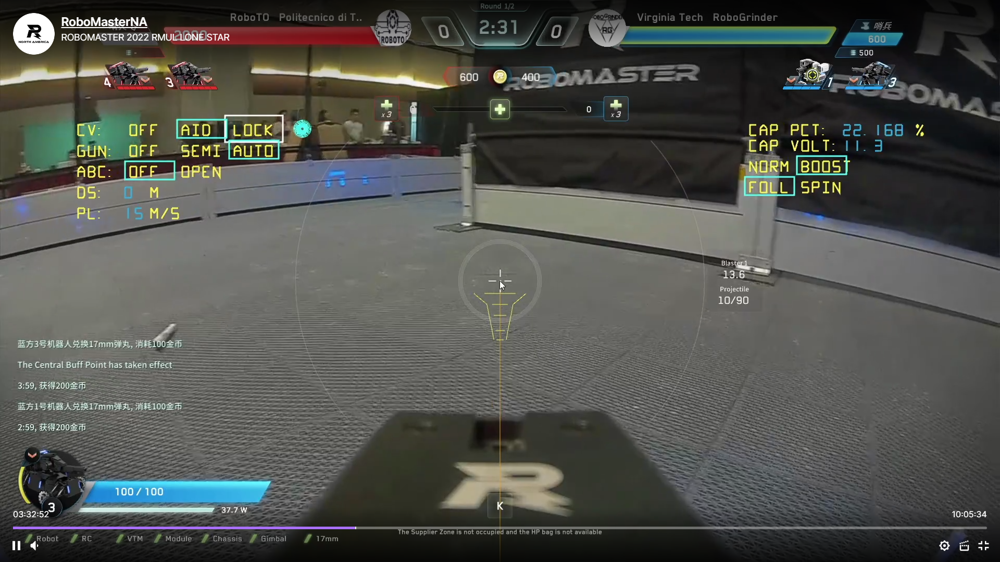
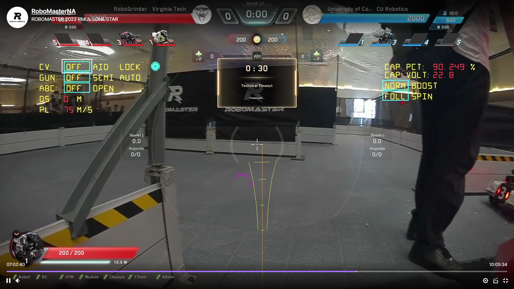

## 概述

- en doc: 目前还没有

- client_ui_task.c 和 client_ui_task.h 实现了 RMUL 操作手客户端 自定义UI

  弗吉尼亚理工; RoboGrinder at Virginia Tech

  

- client_ui_task.h中的部分结构体和宏定义 
  和 client_ui_task.c以下函数:
  void UI_Delete(...);
  void Line_Draw(...);
  int UI_ReFresh(int cnt,...);
  unsigned char Get_CRC8_Check_Sum_UI(...);
  uint16_t Get_CRC16_Check_Sum_UI(...);
  void Circle_Draw(...);
  void Rectangle_Draw(...);
  void Float_Draw(...);
  void Char_Draw(...);
  int Char_ReFresh(...);
  void Arc_Draw(...);
  基于:
  RM自定义UI协议       基于RM2020学生串口通信协议V1.1
  山东理工大学 齐奇战队 东东@Rjgawuie
  RM论坛原文: https://bbs.robomaster.com/forum.php?mod=viewthread&tid=11924
  非常感谢山东理工大学同学们的分享!

- 其它代码和一些新的功能是新增的 并解决了论坛原文中提到的 "无法在客户端界面上画出字符和浮点型数据"的问题
  UI_ReFresh(..); Char_ReFresh(..); Delete_ReFresh(..); 中新增了: 自动通过裁判系统用户串口 动态的获取当前机器人ID 并确定目标操作手客户端ID;

  详细的使用和说明见readme.md(下文)

  静态的UI, 如瞄准线, 图形操作都是 "创建"增加(UI_Graph_ADD)
  动态的UI, 如超级电容电压, 会在线程的while开始前先 增加(UI_Graph_ADD)一次, 然后在while中主要 修改(UI_Graph_Change) 并以1HZ的频率 增加(UI_Graph_ADD) 一次当前最新的动态UI
  	这样做的目的是为了保证 无论操作手客户端或赛事服务器 出什么问题; 比如 操作手客户端和赛事服务器 需要在机器上电之后重启; 以1HZ的频率 增加(UI_Graph_ADD) 这样保证了动态UI的一直稳定显示
  	也就是说, 操作手在操作手客户端无法 "清除(Clear)", 只能通过 "隐藏(Hide)"来关闭自定义UI的显示

  超级电容的显示可以在右上角, 但建议放到中间, 代码中有写在中间显示超级电容电压和百分比(注释掉了)

  将 void client_ui_task(void const *pvParameters) 创建为RTOS(使用FreeRTOS)线程, 比如以下代码
  osThreadDef(UI, client_ui_task, osPriorityNormal, 0, 512);
  client_ui_task_handle =  osThreadCreate(osThread(UI), NULL);

  void ui_coord_update(): 有一些来自其它文件的全局变量和FSM的需要自行修改
  void UI_SendByte(unsigned char ch): 串口驱动映射, 也需自行修改为使用的板级串口

  如果有任何问题和修改意见欢迎联系: zshen25@vt.edu
  或微信: wxid_0217pg5fk4y711

### 软件环境

 - Toolchain/IDE : MDK-ARM V5
 - STM32F4xx_DFP Packs:2.13.0
 - STM32CubeMx:5.2.1
 - package version: STM32Cube FW_F4 V1.21.1
 - FreeRTOS version: 10.0.1
 - CMSIS-RTOS version: 1.02

### 具体使用和说明

- 英雄和步兵的操作手客户端自定义UI界面比较相似. 此文档会一起对他们进行介绍
- 步兵界面:

- 英雄界面

1.屏幕中间瞄准线:

瞄准线从上往下根据射击的目标距离, 每个档位, 依次标定。两侧像漏斗一样的线叫漏斗线, 把大装甲板框在两个漏斗线中间, 即用于瞄准大装甲板。中间水平的横线, 贴合小装甲板的长度, 用于瞄准小装甲板。整套瞄准线可以左右移动以补偿每次摄像头安装的误差。

英雄机器人: 中间靠左的紫色瞄准线用于侧面17mm小枪管的瞄准。圆圈框住装甲板即可。

2.左上角区域: 显示了云台和与之相关的一些信息

CV自瞄状态: 关闭, 辅助瞄准, 锁定目标瞄准; 蓝框为当前操作手选择的状态机状态; 白框为miniPC反馈的当前自瞄控制数据的工作模式

GUN枪口状态: 关闭, 半自动, 全自动; 就是对应单点和连发

Ammo Box Cover 弹舱盖: 闭合, 开启

3.右上角区域: 机器人底盘相关信息

超级电容的电压与百分比

底盘两种运动状态: normal, boost

底盘跟随chassis follow gimbal yaw; 小陀螺开启
